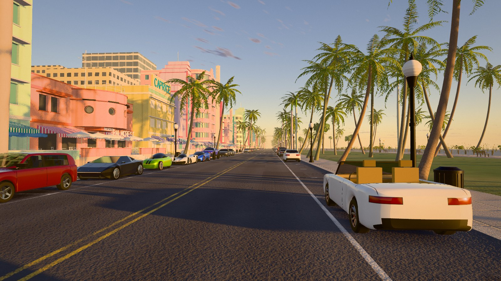
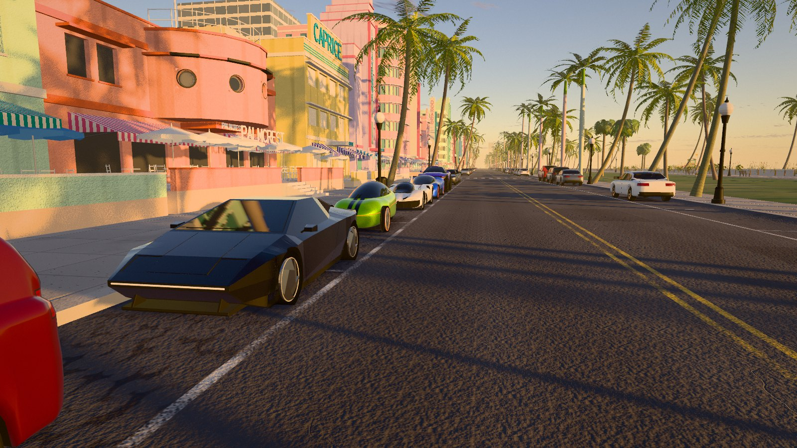
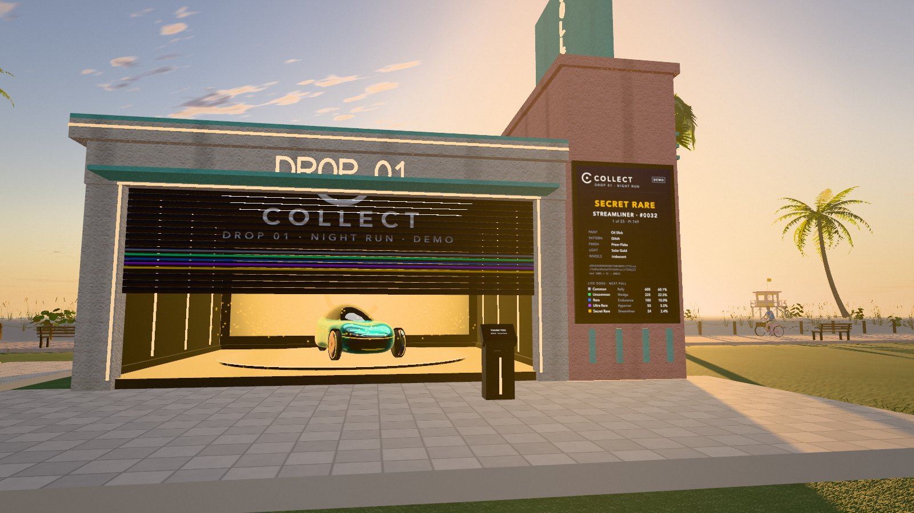
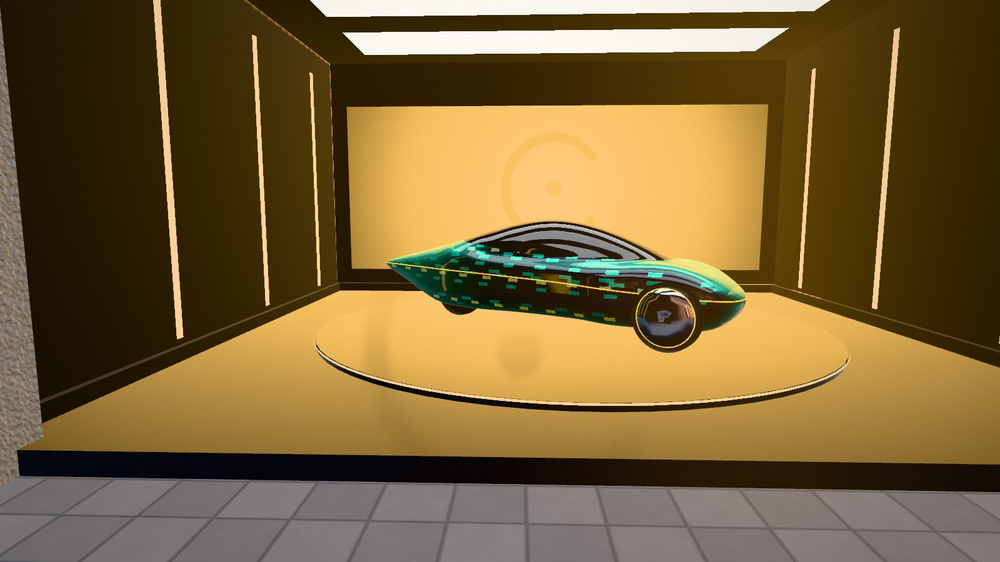
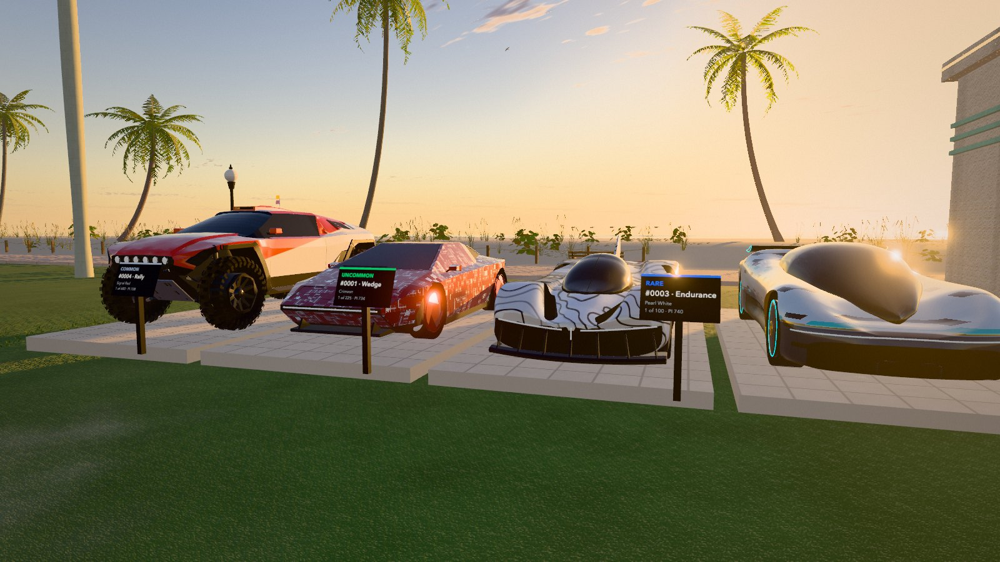

# Ocean Drive

**Play:** https://drcollect.github.io/ocean-drive/ (GitHub Pages) · https://ocean-drive-theta.vercel.app (Vercel). Best on a desktop browser with a mouse; phones get a lighter version with touch controls.



A walkable first-person Ocean Drive, Miami Beach, at sunrise, in the browser, generated in code: about forty Art Deco hotels, 160 palms, the street with its parked cars, Lummus Park, the beach and the Atlantic, a few early people and birds, a beach cruiser and the lifeguard ATV to ride, every car to drive (and crash), and a fully synthesized soundscape. In Lummus Park, across the street from where you start, stands the **Collect Drop garage**: a simulation of Collect Car · Drop 01 (DEMO data; the drop's spec isn't part of this repo). Pay $99 (demo price) at the kiosk, 32 random bytes come in, the number mod the cars left picks your edition, the door rolls up and your car turns on the stand in its look. The five published editions stand in a row in front of the hotels, more editions are parked along the street. Vite + TypeScript + Three.js.

| | |
|---|---|
|  |  |
|  |  |

| Path | What |
|---|---|
| `BRIEF.md` | The place, the directions considered, what was decided, status |
| `refs/spec.md` | The full build spec |
| `game/` | The scene (`npm install && npm run dev`) |
| `renders/final/` | The review cameras (A–H from the spec, I the Collect row, J the drop garage) and drop reveals, as JPGs |
| `renders/shots/` | Working screenshots (not in git) |
| `scripts/montage.py` | Tiles screenshots into review sheets |
| `concepts/`, `blend/` | Unused so far (everything is built in code) |

The Collect cars come from `~/blender/Collect Car/export` via the game-ready versions in `~/blender/Collect NYC/game/public/models/cars` (copied to `game/public/models/cars`). They are the only files the scene loads; everything else, including every texture, sound and the other cars, is generated at startup.

## Run it

```bash
cd game && npm install && npm run dev     # http://127.0.0.1:5193
```

Click to start (locks the mouse and starts the sound). WASD walk, Shift faster, Space jump, E get on/off the bike or ATV (W/S throttle, A/D or the mouse steer), into or out of any car, or pay at the drop kiosk, I show/hide the car card, R twice (at the garage) resets the drop, M mute, Esc releases the mouse. On a phone: tap to start, left thumb to walk, drag to look, buttons for jump, use, card and mute.

**Driving.** Stand next to any car and press E: the parked road cars, the Collect cars along the street, your pulled car on the garage stand or in the bays, even the moving sedan once it has stopped for you. W/S throttle and brake (and reverse), A/D steer, the mouse swings the camera, C switches between the chase view and the driver's seat, E gets you out (the car stays where you leave it). Collect cars drive by their ratings: top speed from Speed (the Streamliner is quickest in a straight line), pull from Acceleration and Launch, stopping from Braking, lock from Handling, and the Rally hardly slows in sand.

**Crashing.** Hit another car and it gets knocked: an impulse from both cars' masses and speeds shoves it, slides it sideways and spins it about the point of contact, and it can knock the next one on. Your car bounces and spins too; walls, trunks and posts bounce you off. Sparks fly where cars meet, the view shakes, and a parked road car you knock sets off its alarm. The moving sedan can be hit as well.

## The Collect Drop garage

A streamline-Deco pavilion in the park (`game/src/drop/`): a pay kiosk, the live-odds board on the tower, a roller door, a turntable in a black showroom, and four bays for your earlier pulls.

- **The drop** (`drop01.ts`): 1,000 editions in five tiers (600 Common Rally, 225 Uncommon Wedge, 100 Rare Endurance, 50 Ultra Rare Hypercar, 25 Secret Rare Streamliner), derived from the DEMO seed with SHA-256 exactly as the spec describes. The tier shuffle and every looks draw reproduce the five editions the spec publishes (#0001, #0003, #0004, #0020, #0032). Per-car tuning follows the spec's rules but is a re-implementation (the drop's generator isn't here), so ratings of other editions are this demo's; the published five show their published numbers.
- **A pull**: the bill goes in, 32 random bytes come from the browser (as on the drop's demo page), value mod cars left = slot, the edition in that slot is yours and the last one moves into the slot. The board shows the bytes and the maths; the tier stays secret until the door rolls up and the showroom lights up in the tier's colour (sparks for the rarer ones, a strobe for Secret Rare). The card has the look, ratings, PI, personality, spec (game-tuned) and "Verify this pull". Live odds move as the pool empties.
- **Looks** (`livery.ts`): the five traits drawn on the Collect GLBs in the car's own space: solid, metallic, pearl (shifts colour with the angle), two-tone with a chrome line, liquid-metal specials that flip; the eight patterns; finishes including brushed and prism flake; light colour on the strips and wheel rings; wheel finishes including iridescent. Render choices where the spec gives none: the Ultra Rare two-tone hexes and each pattern's accent colour.
- **Your pulls** are kept in this browser (localStorage `od.drop01.v1`): the last four stand in the bays with placards. Console: `__od.drop.pull(32)` pulls a given edition if it's still in the pool, `__od.drop.reset()`.
- Everything is labelled DEMO and "$99 (demo price)".

URL options: `?q=high|medium|low` quality tier (default from the GPU: base Apple M-chips get medium, Pro/Max and discrete GPUs high, phones low), `?hud=1` fps readout, `?cam=A`…`J` start at a review camera (I looks along the Collect row, J at the drop garage), `?t=28.6` freeze the clock (the surf is on a fixed schedule, so a time is a repeatable moment), `?drop=7` repeat which editions are parked along the street (without it every load picks new ones; the console prints the number). The review renders use `?t=28.6&drop=7`.

## Online

- **GitHub Pages:** https://drcollect.github.io/ocean-drive/, built and deployed by `.github/workflows/pages.yml` on every push to `main` (`vite build --base=/ocean-drive/`, so every asset path is relative to the base).
- **Vercel:** https://ocean-drive-theta.vercel.app, deployed with `npm run deploy` in `game/`.

A static site: the only files it loads besides the bundle are the five GLBs; the drop garage keeps your pulls in the browser.

## How it's built (game/src)

- `sky/` single-scattering atmosphere (Rayleigh, Mie, ozone, plus skylight in the haze) baked once to an equirect sky; cloud streaks and the sun disc drawn live. The same model gives the sun's colour and the haze colours.
- `renderer/` HDR pipeline (MSAA or FXAA by tier, bloom, Khronos Neutral tone mapping, warm/cool grade), the humid haze that replaces three's fog, the sun's PCSS shadows in a box that follows you along the street snapped to texels, and dynamic resolution.
- `world/` layout and terrain, hotels (facades with real openings, eyebrows, portholes, glass block, stepped parapets, blade and parapet signs in code-drawn letters, weathered stucco, café terraces), palms (three species, alpha-cut fronds with matching shadows, shared wind, backlit glow), street, park, beach (raked grooves, footprint trails, wrack line, wet sand with micro-shadows), ocean (scheduled breakers, foam, swash sheet, glitter path), towers, people, birds.
- `world/carModel.ts` the parked road cars: bodies lofted from smooth side, plan and section profiles (six designs: sedan, SUV, hatchback, pickup, convertible, 1950s classic), faces sorted into paint, tinted glass, trim and cabin, alloy wheels, at three levels of detail. `world/cars.ts` parks them (the level of detail follows you), draws lamps, grille and shut lines in the paint shader, and drives the one moving car. `world/collect.ts` loads the Collect GLBs and dresses them as Drop 01 editions; `renderer/probe.ts` takes reflection probes (the street for glass and chrome, the showroom at each reveal).
- `drop/` the Collect Drop garage: `drop01.ts` (the drop), `livery.ts` (looks), `garage.ts` (pavilion, board, kiosk, door, sequence, bays), `site.ts`; `ui/dropCard.ts` the card, `audio/dropSfx.ts` its sounds.
- `world/surf.ts` the surf schedule shared by the ocean shader, the wet sand, the walker and the wave sounds (the same integer hashes in GLSL and JS), so the swash you see arrive is the swash you hear.
- `player/`, `vehicles/` walker, collisions and surfaces, touch controls; one ride model for the cruiser, the ATV and the cars; `vehicles/drive.ts` gets you into any car (parked cars become cars of their own, left cars keep a collider).
- `audio/` Web Audio, HRTF: wave voices along the shore, swash at your feet, gulls from the visible birds, wind by nearby palms and gusts, footsteps per surface, the passing car with Doppler, generative bossa nova (Karplus–Strong guitar) from one terrace, freewheel, ATV engine.

Dev hooks in the browser console: `__od.cam('E')`, `__od.shot('name')` (saves `game/.shots/name.png`), `__od.bench()`, `__od.sim(['KeyW'], 2)`.
